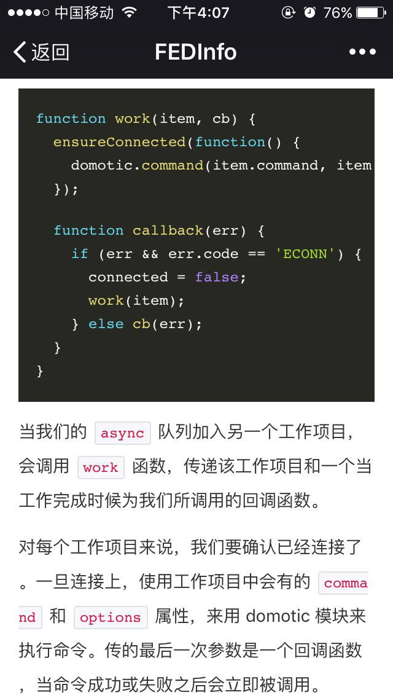

# 微信公众号编辑助手

简单的微信公众号编辑助手插件。可用于抓取博客，生成 `Markdown` 并注入一键注入到公众号编辑器。

如果您只需要代码高亮功能，请访问 [https://angusfu.github.io/wx-editor/](https://angusfu.github.io/wx-editor/)。

## Features
- 专为微信图文推送定制，`Markdown` 编辑省心省力
- 代码高亮保证好用，七种 Prims 代码主题任你选
- 踩过的坑足够多，成功避开微信过滤机制造成视觉效果偏离预期
- **无需 CV 大法**，一键帮你写入微信
- **无需繁杂的保存图片、上传流程**，替你完成全部上传工作
- 直接抓取[众成翻译](http://www.zcfy.cc/)的 Markdown，快速便捷
- 使用 [Mercury Web Parser](https://mercury.postlight.com/) 抓取任意博客文章页
- 内置[奇舞周刊](https://weekly.75team.com)编辑工具

## 使用方式
1. 下载 zip 压缩包到 PC 本地，并解压
2. 在 Chrome 中打开扩展程序设置页 [chrome://extensions/](chrome://extensions/)
3. 右上角勾选`开发者模式`
4. 点击`加载已解压的扩展程序`按钮，选择刚刚解压得到的文件夹
5. 完成，记得启用扩展程序哟~

## 选项说明
- **Code Style**： 用于更换代码高亮主题
- **New**：点击后会弹出输入框，可以输入新的文章地址
- **Weekly**：奇舞周刊编辑工具
- **Inject**：编辑完成后，点击`Inject`即可

## 注意事项
1. 所有图片尽量不超过 **2 M**
2. 仅支持 `jpg, gif, png` 等格式
3. **不支持** `webp, svg` 等其他格式
4. 发生问题的图片，在插入微信编辑器中时，会以默认图替代
5. 编辑完成后，请务必到微信中预览...
6. 编辑时请随时做好**整理代码格式**的准备（虽然程序真的已经帮你做了一部分）
7. 如果只需要代码高亮功能，请访问 [https://angusfu.github.io/wx-editor/](https://angusfu.github.io/wx-editor/)

## DEMO

